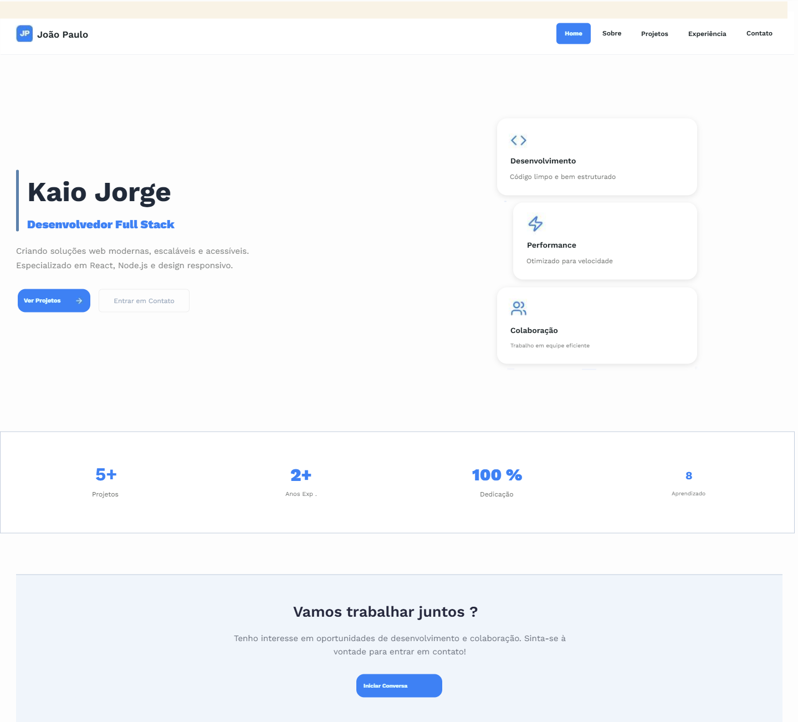
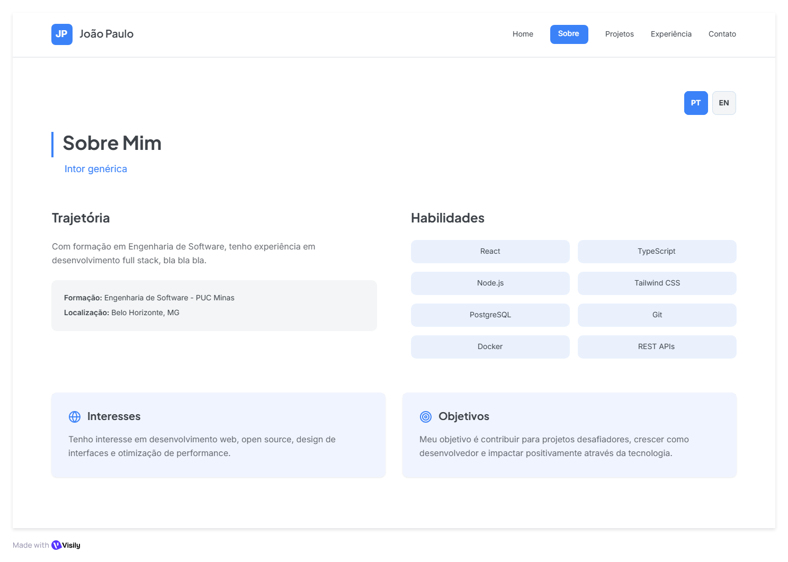
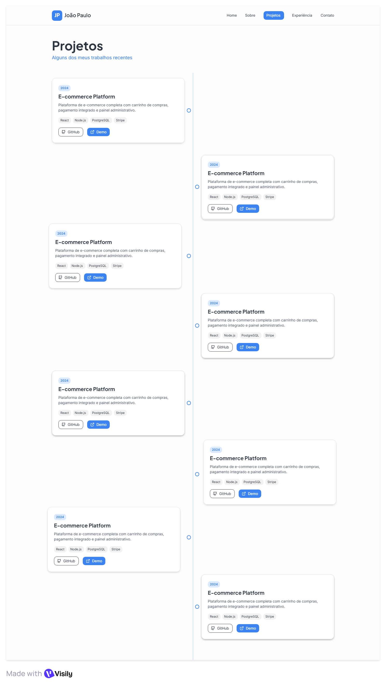
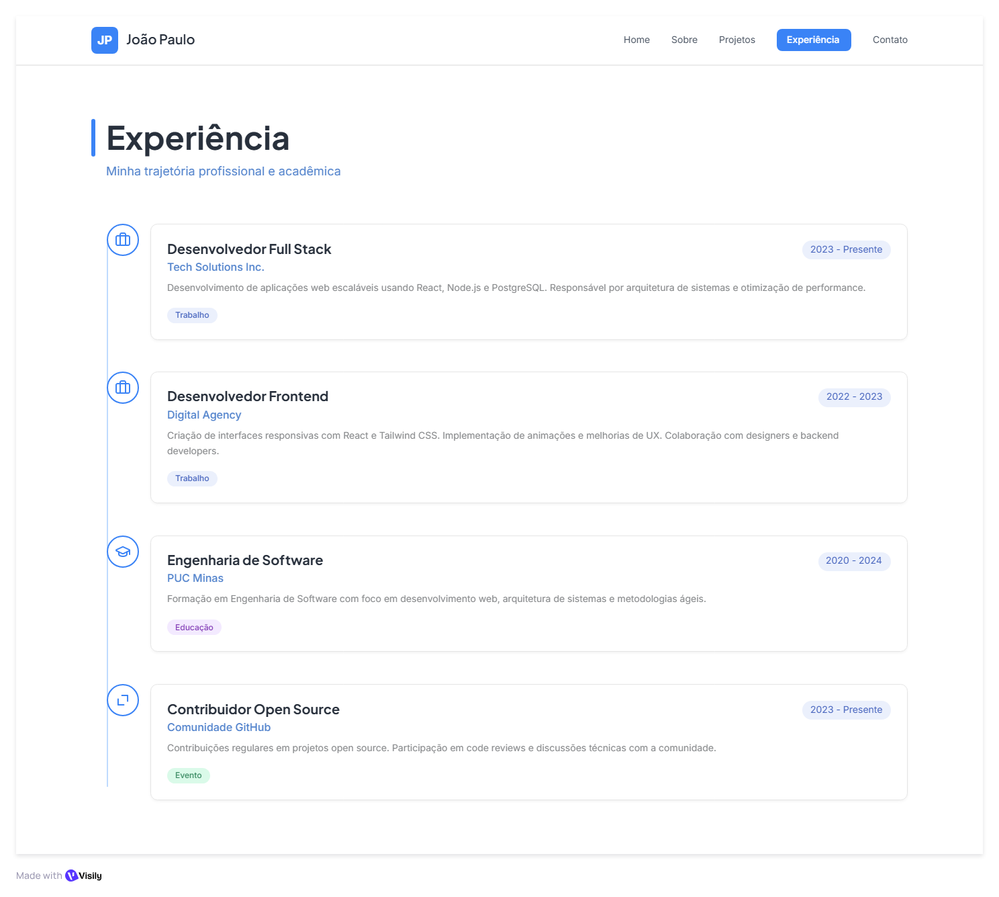
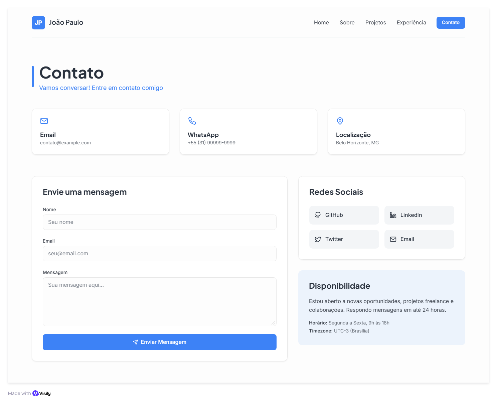

# Portfólio Profissional (LAB01)

<p align="center">
  
  
  
  
</p>

## 📖 Descrição do Projeto

Este repositório contém o desenvolvimento do **LAB01** da disciplina **Laboratório de Desenvolvimento de Software (PUC Minas)**.

O objetivo é construir um website de portfólio profissional com interface moderna, responsiva e acessível, contendo as seções obrigatórias:

- **Sobre Mim** (português e inglês)
- **Projetos** (timeline do mais antigo ao mais recente)
- **Experiências** (empresa/instituição, atividade, período e descrição)
- **Contato** (ícones clicáveis + formulário com envio de e-mail)

O projeto utiliza front-end em React + TypeScript e um endpoint em Express para envio do formulário de contato.

---

## 🗂️ Estrutura do Repositório

- **`client/`**: aplicação front-end (React + Vite).
  - **`src/pages/`**: páginas do portfólio (`Home`, `About`, `Projects`, `Experience`, `Contact`).
  - **`src/components/`**: componentes reutilizáveis (Header, Footer e UI).
  - **`public/projects/`**: imagens exibidas nos cards da seção Projetos.
- **`server/`**: servidor Node/Express com rota `POST /api/contact`.
- **`shared/`**: constantes compartilhadas.
- **`Telas/`**: wireframes/protótipos em PNG usados como evidência das Sprints.

---

## ✨ Funcionalidades Implementadas

- Navegação por menu entre todas as seções.
- Layout responsivo para desktop e mobile.
- Página **Sobre Mim** com conteúdo bilíngue (PT/EN).
- Página **Projetos** com timeline em ordem cronológica.
- Página **Experiências** com dados organizados por tipo e período.
- Página **Contato** com links clicáveis (e-mail, WhatsApp, LinkedIn, GitHub).
- Formulário com validações básicas:
  - nome com mínimo de 2 caracteres;
  - e-mail válido;
  - mensagem com mínimo de 10 caracteres.
- Envio de formulário por e-mail via rota `/api/contact`.

---

## 🧩 Tecnologias e Dependências

### Stack principal

- React 19
- TypeScript
- Tailwind CSS 4
- shadcn/ui
- Express
- Nodemailer
- Vite

### Bibliotecas utilizadas

- `react`, `react-dom`
- `lucide-react`
- `@radix-ui/*`
- `react-hook-form`
- `zod`
- `framer-motion`
- `express`
- `nodemailer`

---

## 🧪 Evidências por Sprint

### Lab01S01 (Planejamento e Prototipação)

- [x] Repositório com README inicial
- [x] Wireframes de média fidelidade
- [x] Protótipo inicial de front-end
- [x] Navegação entre seções
- [x] Layout base (header, conteúdo, footer)

### Wireframes (S1)

Imagens disponíveis em `Telas/`:







### Lab01S02 (Funcionalidades Principais)

- [x] Sobre Mim em PT/EN
- [x] Projetos com timeline
- [x] Experiências organizadas
- [x] Contato com ícones clicáveis
- [x] Formulário funcional com validação
- [x] Responsividade

---

## 🚀 Como Executar o Projeto

### Pré-requisitos

- [Node.js 18+](https://nodejs.org/)
- [pnpm](https://pnpm.io/)

### Passos

1. **Clone o repositório:**
   ```bash
   git clone [URL_DO_SEU_REPOSITORIO]
   cd lab-desenvolvimento-atv01
   ```

2. **Instale as dependências:**
   ```bash
   pnpm install
   ```

3. **Configure variáveis de ambiente (`.env`):**
   ```env
   SMTP_HOST=smtp.seuprovedor.com
   SMTP_PORT=587
   SMTP_USER=seu-email@dominio.com
   SMTP_PASS=sua-senha-ou-app-password
   CONTACT_TO_EMAIL=seu-email@dominio.com
   CONTACT_FROM_EMAIL=seu-email@dominio.com
   ```

4. **Execute em desenvolvimento:**
   ```bash
   pnpm dev
   ```

5. **Build de produção:**
   ```bash
   pnpm build
   ```

6. **Executar build:**
   ```bash
   pnpm start
   ```

---

## 🌐 Deploy

- **Status atual:** não aplicável à Sprint 1/2 (deploy completo previsto para Sprint 3).
- **Sugestão de hospedagem:** Vercel (front) ou Render (fullstack).
- **Link do site publicado:** _adicionar após finalizar Sprint 3_.

---

## 📚 Referência de Template da Disciplina

Template sugerido pelo professor:

Template oficial da disciplina (README) disponibilizado na organização da matéria.

---

## 👥 Autores

- Gabriel Afonso Infante Vieira
- Henrique
- Camila

---

<p align="center"><em>Projeto desenvolvido para a disciplina de Laboratório de Desenvolvimento de Software - PUC Minas</em></p>
